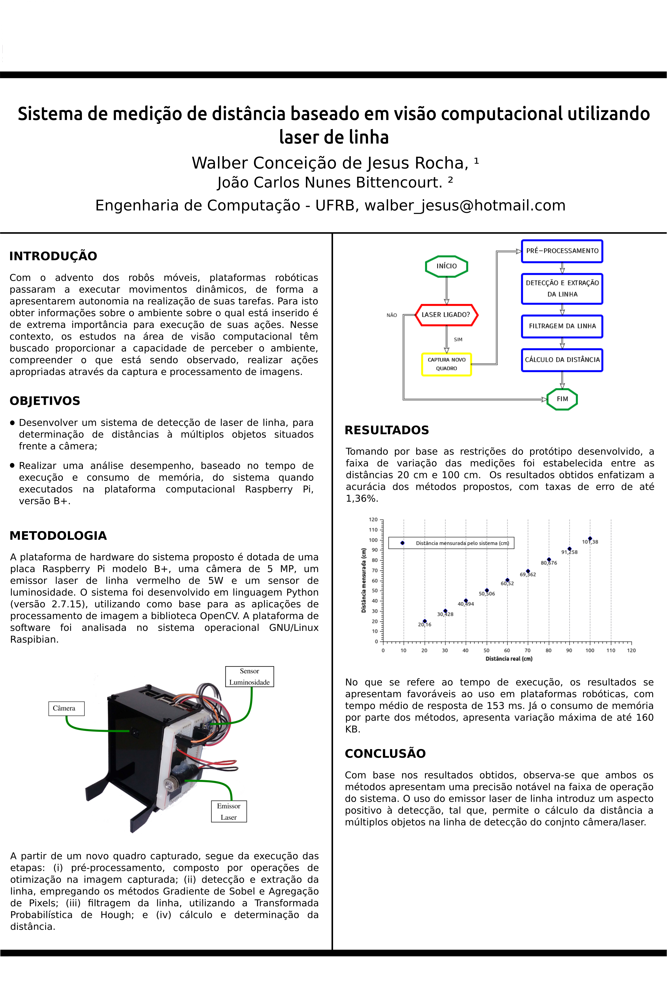

#### Execução do projeto:

##### Instalação dos módulos:
```
pip3 install math, cv2, numpy
```

##### Executar o projeto:
```
python3 laser_rangefinder.py

```
##### Escolha entre os métodos de detecção do laser de linha:
```
Agregação de pixels, utilizar a função: pixel_aggregation('Caminho da imagem')
Gradiente de Sobel, utilizar a função: gradient_sobel('Caminho da imagem')
```

##### Para diferentes distâncias, alterar o caminho da imagem de entrada:
```
img = cv2.imread('Caminho da imagem')
python3 laser_rangefinder.py

```

#### Execução do projeto na plataforma computacional Raspberry PI:

##### Instalação dos módulos:
```
pip install picamera, math, cv2, numpy, smbus, gpio
```
##### Escolha entre os métodos de detecção do laser de linha:
```
Agregação de pixels, utilizar a função: pixel_aggregation('Caminho da imagem')
Gradiente de Sobel, utilizar a função: gradient_sobel('Caminho da imagem')
```

##### Executar projeto:
```
rangefinder-rpi/
python rangefinder.py
```
